# Sync Scenarios

This doc walks through the interesting mirror/sync states swarf can land
in, and what we want to happen vs. what currently happens. The goal is
to verify each scenario is handled correctly — when one isn't, the
"Currently" line points at the bug.

> **Status as of 2026-05-15.** The original "empty project wipes the
> store" bug from 2026-05-12 is partially fixed by commit `70fc2ea`
> (manifest-tracked forward mirror in `internal/mirror/mirror.go`).
> The fix closes the **first-run** failure mode: when a manifest is
> absent (fresh machine, or a slug we've never observed locally), the
> forward mirror does no deletes. The **stale-manifest mid-life**
> failure mode — manifest already records N files, project then loses
> some/all of them between passes — is **still live**. See Scenarios 6
> and 7 for the precise conditions.

## Vocabulary

- **project** — `~/code/<repo>/swarf/` on this machine (the user-facing dir)
- **store** — `~/.local/share/swarf/<slug>/` (local backup, a git repo)
- **manifest** — `~/.cache/swarf/manifests/<slug>.txt`, the set of files
  swarf last observed in *this machine's* project on the previous tracked
  pass (written by `mirror.TrackedDir`)
- **peer cache** — `~/.cache/swarf/peers/<peer>/`, an `rclone sync`
  target of another machine's full store mirror
- **forward mirror** — project → store (`mirror.TrackedDir`, deletes
  propagate only via the manifest)
- **reverse mirror** — store → project (`mirror.Dir`, destructive:
  anything in project missing from store gets deleted)

## The two mirror functions

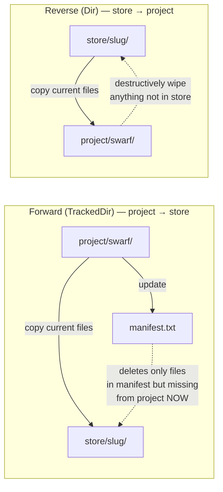

The asymmetry matters: forward mirror is conservative (manifest gates
deletes), reverse mirror is destructive (anything not in source gets
removed).

Three call sites use `TrackedDir`:
- `internal/daemon/runner.go:mirrorAllProjects` (every debounce)
- `internal/push/push.go:Run` (on `swarf push`)
- `internal/pull/pull.go:mirrorProjectsToStore` (start of `swarf pull`)

One call site uses `mirror.Dir`:
- `internal/pull/pull.go:mirrorStoreBackToProjects` (end of `swarf pull`)

## Scenario 1: User edits a file in project

**Want:** edit propagates to store, then to remote, then to peers on their next pull.

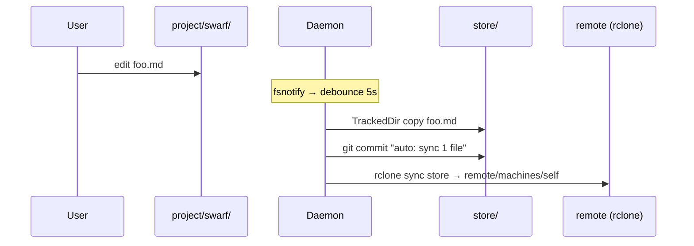

**Currently:** ✅ works. Manifest gets updated to include `foo.md`,
forward mirror copies, daemon's `backend.Sync` pushes.

## Scenario 2: User deletes a file in project

**Want:** delete propagates to store and remote.

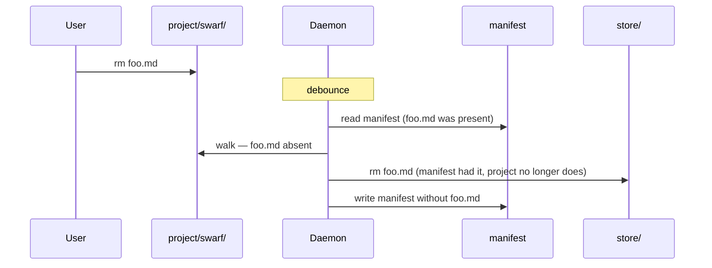

**Currently:** ✅ works. The manifest gating is exactly what makes this safe.

## Scenario 3: First-ever run on this machine, project/swarf/ is empty

**Want:** no destructive action — manifest doesn't exist, nothing to delete from store.

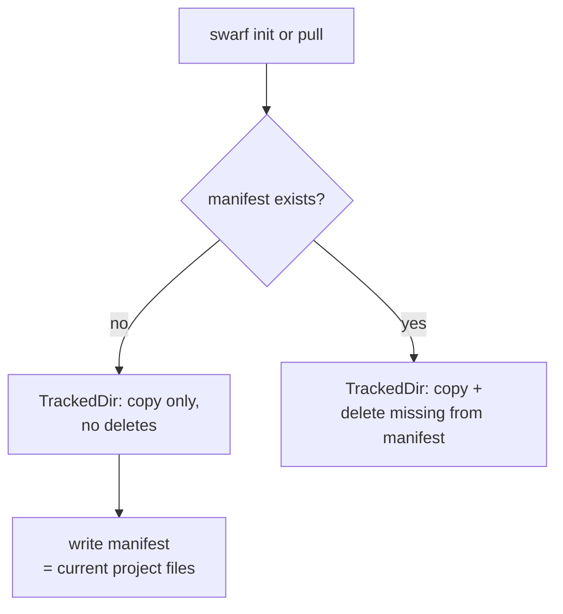

**Currently:** ✅ works. `readManifest` returns an empty set when the
file is absent, so the delete loop in `TrackedDir` has nothing to act on.
Locked in by `TestPushDoesNotWipeStoreOnFirstRun` (push package) and
`TestMultiMachine_EmptyProjectDoesNotWipeStore` (integration).

## Scenario 4: Pull from a peer that has files we don't

**Want:** peer files land in *both* the local store *and* the project.

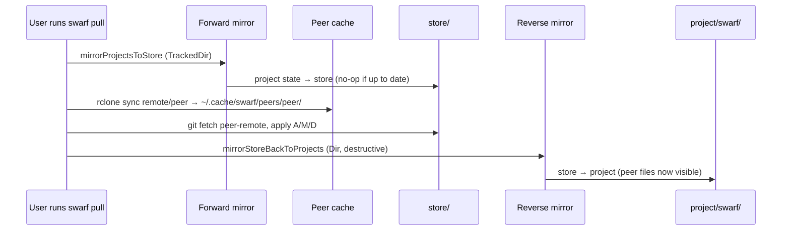

**Currently:** ✅ works in the common case. Tested by
`TestMultiMachine_AEditsPushes_BInits`,
`TestMultiMachine_BInitsFirst_ThenPullsA`,
`TestMultiMachine_RoundTrip`. The race window with the daemon (Scenario 5)
is the remaining concern.

## Scenario 5: Daemon is running while user runs `swarf pull`

**Want:** they don't fight. Either the daemon's forward mirror or
pull's forward mirror runs first; the result converges.

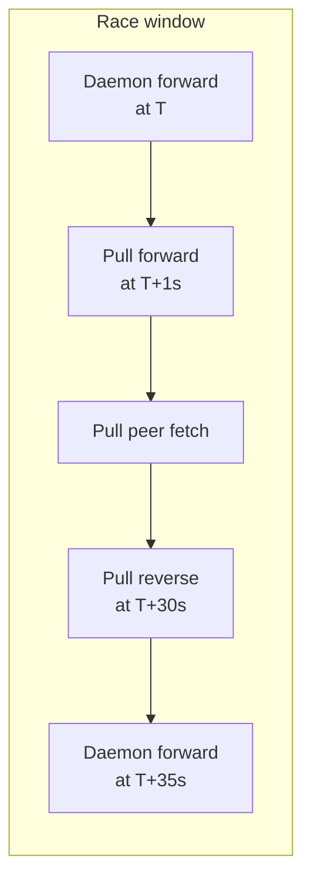

**Currently:** ⚠️ unverified. There's no lock between daemon and pull.
With the manifest in place, two interleavings are worth thinking about:

- **Daemon's forward fires during pull's reverse mirror.** Pull just
  wrote 50 of 693 files to project/swarf when the daemon's debounce
  trips. Daemon's `TrackedDir` reads project/swarf at this transient
  point, sees 50 files, the manifest from the prior cycle had (say) 0,
  newSet = 50 → no deletes against the store, manifest = 50. Reverse
  mirror finishes writing the remaining 643 files. Next daemon cycle
  picks them up cleanly. **Probably fine.**
- **Daemon's forward fires after pull's forward but before reverse.**
  Project at this moment is whatever it was when pull started. If pull's
  forward already updated the manifest to that state, daemon's
  `TrackedDir` is a no-op. Then pull's peer fetch runs, then reverse
  mirror writes 693 files. **Probably fine.**

The risk is subtler: if the daemon and pull both call
`writeManifest` concurrently, the second writer wins and the file
content depends on which `WalkDir` instance it reflects. A test that
intentionally interleaves the two calls would tell us whether that's
real.

## Scenario 6: 🔴 Project files vanish between daemon passes (the bug)

This is what bit us on 2026-05-12. Reconstructed from `daemon.log`.

**Setup:** A previous pull seeded `~/code/forms/swarf/` with 693 files
from peer `matt-schulkind-3wny6v`. `TrackedDir` recorded all of them in
the manifest.

**Trigger:** Between daemon passes (23:06:36 → 01:16:00 — a 2h10m
window), 693 files vanished from `~/code/forms/swarf/`. Most likely
cause: a worktree cleanup, a stray `rm -rf`, a containerized process
deleting a mounted directory, or a separate `swarf pull` that ran
forward-mirror against an already-stale project.

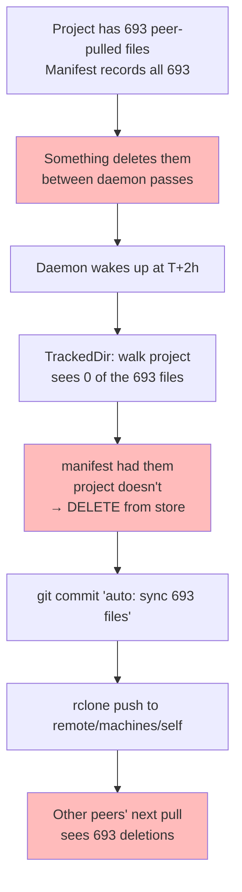

**The bad assumption:** "manifest says we had it, project doesn't, so
the user deleted it." This is wrong when the project itself is in a
broken/incomplete state — `TrackedDir` can't tell "user deleted 1 file"
apart from "something wiped 693 files."

**What `swarf status` showed afterwards:** 949 files locally, 3733 on
remote — the local store had been pruned, the other peer's full mirror
on remote was untouched.

**Recovery path:** the per-peer cache at `~/.cache/swarf/peers/<peer>/`
is *not* affected by local manifest logic — it's a one-way `rclone
sync` target. So the data is recoverable from there even after the
local store is pruned, as long as the peer cache hasn't been
re-synced from a remote that already lost the files.

**What changed since the original incident:** commit `70fc2ea`
introduced `TrackedDir` so the *first* pass (no manifest) doesn't
delete. That fix handles the "fresh machine" subcase. It does **not**
help once the manifest is populated — the failure mode above is
identical post-fix.

### Mitigations to design for

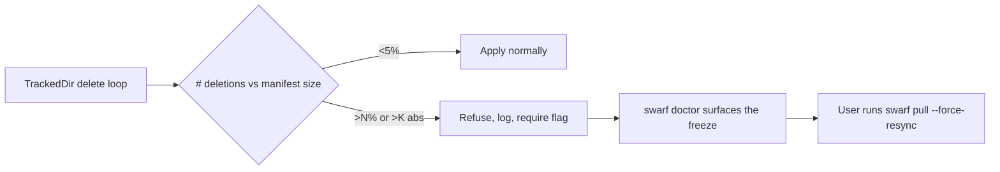

Two thresholds worth considering:
- **Sanity guard** in `TrackedDir`: if deletions > 25% of manifest *and*
  > 50 files, refuse and log a warning. The daemon writes a quarantine
  marker; `swarf status`/`doctor` surface it. User must run an explicit
  recovery command to acknowledge.
- **Heartbeat manifest**: record the project mtime + file count
  alongside the manifest. If the count drops by more than X between
  passes, treat as suspect.

## Scenario 7: 🔴 Pull's forward-mirror clobbers the store before fetching peers

**Want:** pulling from a peer never makes things *worse* than before pulling.

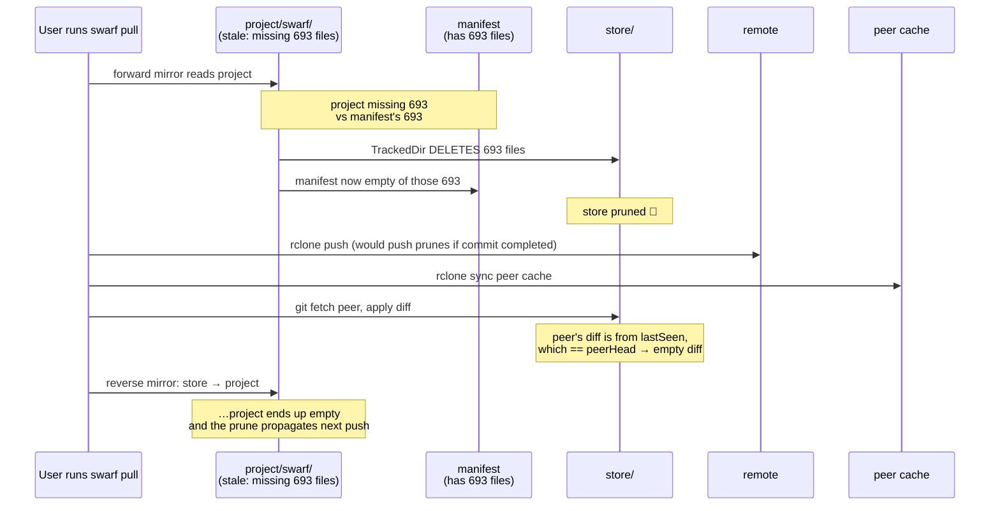

**Currently:** 🔴 still broken in the stale-manifest subcase.

`pullRclone` calls `mirrorProjectsToStore()` unconditionally at
`internal/pull/pull.go:118`, *before* fetching peer state. The
post-`70fc2ea` behavior:

| State at start of pull                                | Forward mirror result        | Outcome |
|-------------------------------------------------------|------------------------------|---------|
| No manifest (first run, fresh machine)                | No deletes                   | ✅ safe (Scenario 3) |
| Manifest = N files, project = same N files            | No deletes                   | ✅ safe (idle case) |
| Manifest = N files, project missing K of them         | K deletes against the store  | 🔴 the bug |

The middle column is what `TrackedDir` fixed. The right column is what
the user originally reported — and it's still live.

The justification in the source is *"a manual `swarf pull` shouldn't
lose work the user just saved"* — but that's a false trade. The work
the user "just saved" is also visible to the daemon and would have
been pushed on its next debounce. Pull running forward-mirror is a
nice-to-have at best and a foot-gun at worst.

**Fix candidates:**
1. **Don't forward-mirror inside pull.** Daemon already handles
   project→store on its own schedule. Pull becomes read-only against
   the project until the reverse step. Lowest risk, smallest diff.
2. **Skip forward-mirror if it would be a mass delete.** Use the
   sanity guard from Scenario 6.
3. **Forward-mirror only changed files since last manifest write,
   never deletions.** Pull is then strictly additive on the project
   side.

Recommendation: **(1)**. The daemon does this work; pull doing it
again is a duplication that introduces risk without buying anything.

## Scenario 8: User deletes the entire project/swarf/ directory by accident

**Want:** the next forward pass should NOT wipe the store.

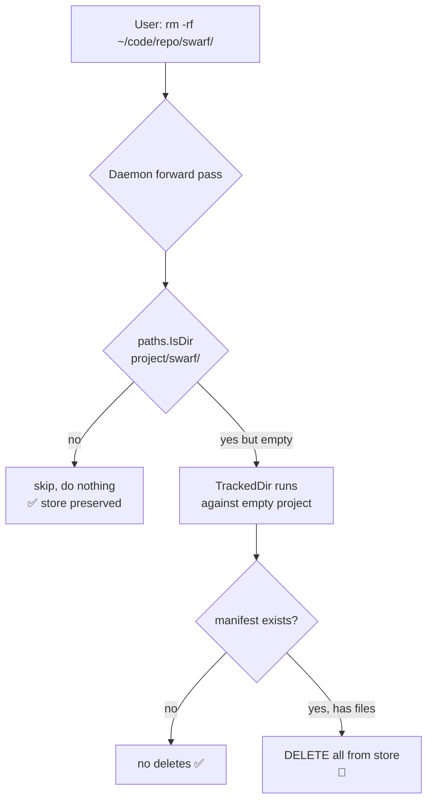

**Currently:** ✅ for the "directory removed" case —
`mirrorAllProjects` in `runner.go:78-90` skips when `paths.IsDir(src)`
is false. ✅ for the "directory still exists, never had content"
case — manifest is absent. 🔴 for the "directory still exists, used
to have content, now emptied" case — that's Scenario 6 in miniature.

## Scenario 9: Two machines edit the same file between pulls

**Want:** swarf detects the conflict, writes a sidecar, doesn't silently lose either edit.

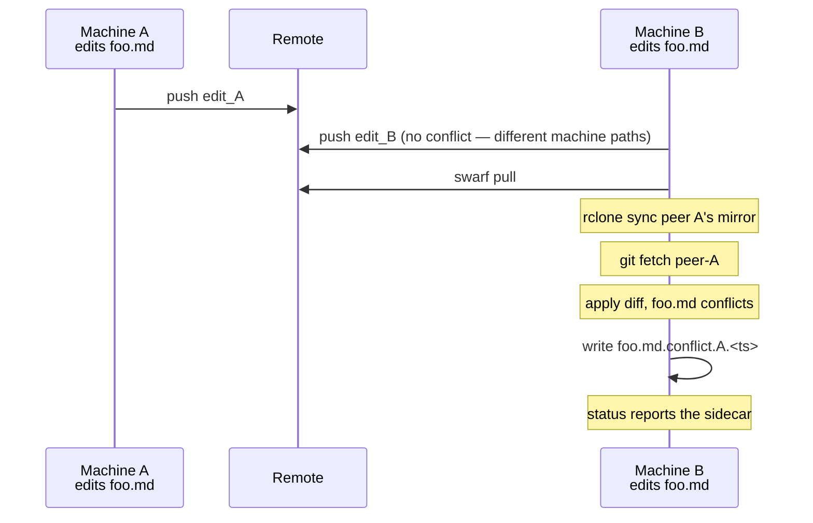

**Currently:** ✅ works for content-level conflicts; produces a
`.conflict.<peer>.<ts>` sidecar. Resolution is manual: edit the original,
delete the sidecar. Documented in `swarf docs conflicts`. Locked in by
`TestPullMultiPeerConflict` and `TestMultiMachine_ConflictingEdits`.

## Scenario 10: A peer disappears (machine retired)

**Want:** dead peer doesn't keep injecting old state into other machines.

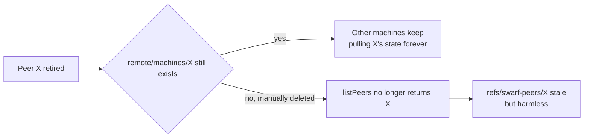

**Currently:** ⚠️ unverified. There's no UX for "decommission a peer."
The `refs/swarf-peers/<peer>` ref tracks last-seen, but if a peer's
remote dir is never deleted, its frozen state keeps showing up.

## Scenario 11: Manifest corruption / partial write

**Want:** a corrupt manifest never causes mass delete; the safe failure mode is "no deletes this pass."

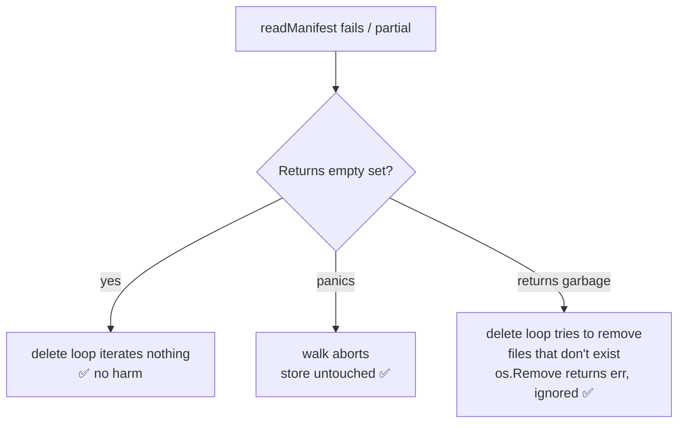

**Currently:** ✅ defensive by accident. `readManifest` returns an
empty map on any read error. `os.Remove` errors are swallowed. Worth a
test to lock this in.

## Scenario 12: Bringing up a second computer (the user's current scenario)

**Want:** on machine B with config pointing at the same remote as A,
the documented flow (`swarf init` in the project, then `swarf pull`)
ends with B's store and remote subtree both fully populated, and A's
remote subtree untouched.

```mermaid
sequenceDiagram
    participant U as User on B
    participant Cfg as ~/.config/swarf/config.toml
    participant S as B's store
    participant Rmt as remote
    participant P as B's project/swarf
    U->>Cfg: swarf init (interactive)
    Note over Cfg: writes config + machine_id<br/>(default: hostname slug)
    U->>S: EnsureStore — empty git repo
    U->>P: initialize.Run<br/>copyDirInto(store/slug, project/swarf)<br/>store/slug doesn't exist → 0 files seeded
    Note over P: project/swarf empty, drawer registered
    U->>S: swarf pull
    S->>S: mirrorProjectsToStore (TrackedDir)<br/>no manifest, project empty → no-op<br/>writes empty manifest
    S->>Rmt: rclone sync remote/machines/A → peer cache<br/>git fetch peer-A
    S->>S: apply A/M/D from peer (union mode if no merge-base)<br/>store/slug now has all of A's files
    S->>P: mirrorStoreBackToProjects (Dir)<br/>destructive: store/slug → project/swarf
    Note over P: project/swarf has 693 files
    Note over S,Rmt: daemon (or `swarf push`) eventually fires
    S->>Rmt: TrackedDir(project, store, manifest)<br/>oldSet=empty, newSet=693<br/>no deletes; manifest = 693
    S->>Rmt: rclone sync store → remote/machines/B
    Note over Rmt: remote/machines/B now mirrors A's content
```

**Currently:** ✅ on paper — every step in the trace above lands the
right way given the post-`70fc2ea` code. Specifically:

- The `TrackedDir` on pull's forward mirror sees an absent manifest
  and short-circuits to "no deletes."
- After reverse mirror lands files in the project, the manifest is
  *still* empty (pull's forward mirror wrote it before reverse mirror
  populated the project). Next daemon/push cycle records the full set,
  no deletes happen, and the manifest is brought up to date.
- Backend `Sync` pushes to `remote/machines/<self_id>/` — A's subtree
  is never touched.

**What could still go wrong (worth pinning down):**
- **Same `machine_id` on both computers.** `DefaultMachineID()` slugs
  the hostname. If both machines happen to share a hostname (e.g.
  generic `macbook` defaults), they collide and the second push wipes
  the first's remote subtree. No protection in code. Worth a
  `swarf doctor` check that warns when listPeers returns the same id
  as `machine_id`. *(Smoking gun candidate for the user's report.)*
- **Daemon not running on B.** Init offers the service install but a
  user on a fresh second computer who declines / hasn't been root /
  is in a non-systemd container won't have a daemon. `swarf pull`
  alone leaves the store correct; `remote/machines/B` is *not*
  populated until something pushes. If the user expects pull to also
  push back, this looks like "wiped" because B's remote subtree is
  empty even after pull.
- **Project/swarf existed before init.** If the project dir already
  had stale content from an earlier experiment, that content goes
  into the manifest on first pass. Subsequent cycles where it's
  removed look like deletions and get applied to the store —
  Scenario 6.
- **An out-of-date binary on one of the two machines.** Pre-`70fc2ea`
  push uses the destructive `mirror.Dir` path and will wipe a store
  populated by pull. Worth confirming both binaries are post-fix.

**Suggested next step:** add an integration test that mirrors the
*exact* user-reported flow (init then pull on a fresh machine, with
the daemon not running, then run `swarf push` once to confirm B's
remote subtree gets populated without affecting A's), and a
`swarf doctor` check for machine_id collision against `listPeers`.

## Verification matrix

| # | Scenario | Status | Test |
|---|----------|--------|------|
| 1 | Edit propagates | ✅ | daemon path; integration round-trip |
| 2 | Delete propagates | ✅ | `TestMultiMachine_DeletePropagates` |
| 3 | First run, empty | ✅ | `TestMultiMachine_EmptyProjectDoesNotWipeStore` |
| 4 | Pull peer files | ✅ | `TestMultiMachine_AEditsPushes_BInits` etc |
| 5 | Daemon vs pull race | ⚠️ | none — needs interleaving test |
| 6 | Project wipe → store wipe | 🔴 | none — bug, partial fix only |
| 7 | Pull's forward clobbers (stale manifest) | 🔴 | none — bug |
| 8 | rm -rf swarf/ | ✅ for absent dir; 🔴 for emptied dir | partial |
| 9 | Cross-machine conflict | ✅ | `TestPullMultiPeerConflict` |
| 10 | Retired peer | ⚠️ | none |
| 11 | Manifest corruption | ✅ defensive | none — should add |
| 12 | Second-computer bootstrap | ✅ on paper | none for the exact flow |

## Proposed work, in priority order

1. **Remove `mirrorProjectsToStore()` from `pullRclone`** (Scenario 7
   fix candidate 1). Smallest diff, biggest safety win — the daemon
   already covers this direction.
2. **Mass-delete sanity guard in `TrackedDir`**. Fixes the residual
   risk in Scenarios 6 and 8 (emptied-dir subcase). Threshold + log
   + quarantine marker surfaced by `swarf doctor`.
3. **`machine_id` collision check in `swarf doctor`**. Cheap to
   implement; closes off the most likely cause of "B's pull wiped A's
   data" reports.
4. **Integration test for Scenario 12.** The exact user-reported
   second-computer flow, end-to-end.
5. **Daemon-vs-pull race test** (Scenario 5). Concurrent invocation,
   assert eventual consistency.
6. **Peer decommission UX** (Scenario 10). `swarf forget-peer <id>`
   that drops `refs/swarf-peers/<id>` and prompts the user to delete
   the remote subtree.
7. **Manifest-corruption regression tests** (Scenario 11). Pin down
   the defensive behavior.
